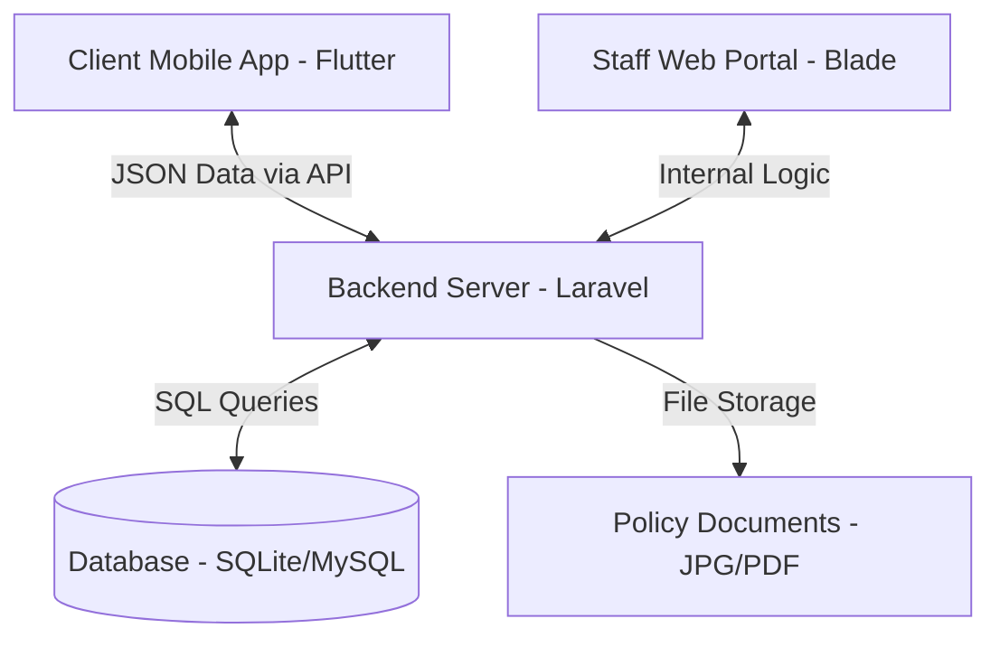
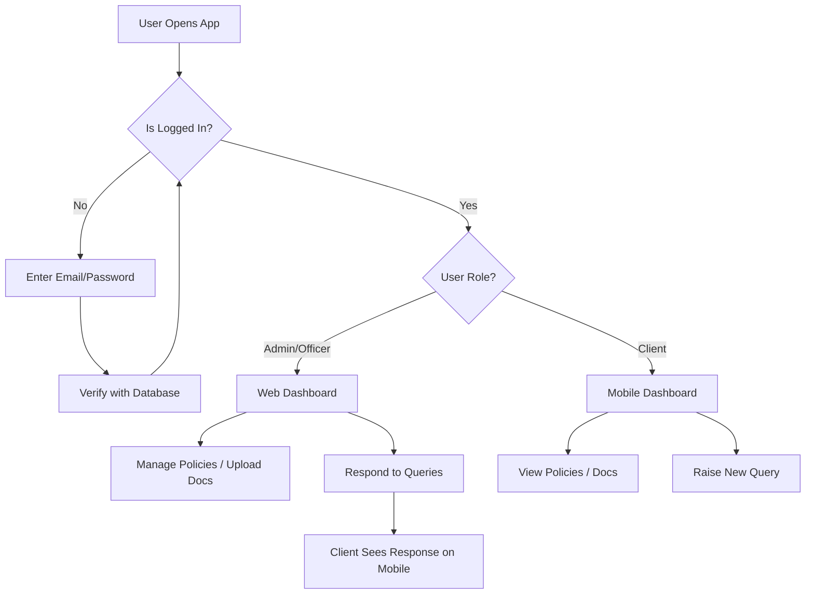

# User SOP: Zimnat Policy Management System

This document provides a comprehensive, beginner-friendly guide to the architecture, design, and implementation of the Zimnat Policy Management System. It is designed for anyone—from a complete beginner to a technical lead—to understand how the application works from the ground up.

---

## 1. High-Level Architecture (The "Big Picture")

Think of the application as a **human body**:

1.  **The Brain (Backend/Server)**: This is where all the logic lives. It decides who can log in, calculates renewal dates, and processes queries. We use **Laravel** for this.
2.  **The Face (Frontend/Client)**: This is what the user sees and interacts with.
    *   **Staff Web App**: The "face" for employees, built using **Laravel Blade**.
    *   **Client Mobile App**: The "face" for customers, built using **Flutter**.
3.  **The Memory (Database)**: This is where we store all information permanently. We use **SQLite** (a lightweight file-based database) for this prototype, which can be easily upgraded to **MySQL**.

### Architecture Diagram

---

## 2. The Tech Stack (The Tools We Used)

### **Backend: Laravel (PHP)**
*   **What it is**: A "framework" is like a pre-built house frame. Laravel gives us the walls and plumbing so we only have to worry about the interior design (the logic).
*   **Why we use it**: It’s extremely secure, fast to build with, and handles "boring" stuff like passwords and logins automatically.

### **Mobile: Flutter (Dart)**
*   **What it is**: A tool by Google that allows us to write code once and have it work on both iPhones and Androids.
*   **Why we use it**: It creates beautiful, "slick and seamless" interfaces that feel professional.

### **Web Frontend: Tailwind CSS & Alpine.js**
*   **Tailwind CSS**: A styling tool that lets us design modern looks (like the Zimnat colors) without writing messy custom code.
*   **Alpine.js**: A tiny tool that makes the web page "alive" (e.g., the sidebars that slide in and out).

---

## 3. The Database (How Information is Saved)

We use a **Relational Database**. Imagine a giant Excel workbook with multiple sheets that are "linked" together.

*   **Users Table**: Stores Name, Email, Password (encrypted), and Role (Admin, Officer, or Client).
*   **Policies Table**: Stores Policy Numbers, Amounts, and Dates. It is linked to a **User** via a "Foreign Key" (an ID number).
*   **Queries Table**: Stores issues raised by clients. It links back to both the **Client** and the **Policy**.

**Data Flow**: When a client raises a query on their phone, the phone sends a small "package" of data to the Brain (Backend). The Brain then writes that data into the Database sheet for "Queries."

---

## 4. Application Components & User Flow

### **Component Breakdown**
1.  **Auth System**: Handles Login/Logout and ensures an "Officer" can't do "Admin" tasks.
2.  **Policy Manager**: Allows staff to create, edit, and delete insurance records.
3.  **Document Vault**: A safe place where PDF/JPG policy documents are uploaded and linked to specific users.
4.  **Query Dashboard**: A "chat-like" interface where clients ask questions and staff respond.

### **User Flowchart**

---

## 5. Software Development Life Cycle (SDLC)

For a project like this, the **Agile (Scrum) Model** is most suitable.

*   **Why?**: In a real company, requirements change daily. Agile allows us to build a small "working piece" (like just the login), show it to the boss (the demo), get feedback, and then move to the next piece.
*   **The Sprint**: We worked in "Sprints"—short bursts of work. For example, Sprint 1 was the Database, Sprint 2 was the Web App, and Sprint 3 was the Mobile App UI.

---

## 6. Maintenance & Future Improvements (Advice)

To take this from a prototype to a world-class application, I recommend the following:

1.  **Push Notifications**: When a Policy Officer responds to a query, the client should get a "Ping" on their phone immediately, not just when they open the app.
2.  **Biometric Login**: Allow clients to use FaceID or Fingerprint on the mobile app for faster access.
3.  **Automated Renewals**: Set up the "Brain" to automatically email clients 30 days before their policy expires.
4.  **Live Chat**: Instead of a query system, implement real-time WhatsApp-style chat within the app.
5.  **Analytics**: Add a chart for the Admin to see which types of insurance (Life, Motor, etc.) are most popular this month.

---

## 7. How to "Handover" this Project

If you are presenting this to a panel:
*   **Focus on Security**: Explain that passwords are never stored as text; they are "hashed" (scrambled).
*   **Focus on Branding**: Mention that we used the **Zimnat Blue (#004a99)** and **Zimnat Green (#7fb13b)** to ensure the app feels like it belongs to the company.
*   **Focus on Scale**: Explain that while it uses a simple database now, the code is "clean" enough to support 100,000+ clients in the future.

---
*Created for Zimnat Life Assurance Candidate Assessment - 2026*
