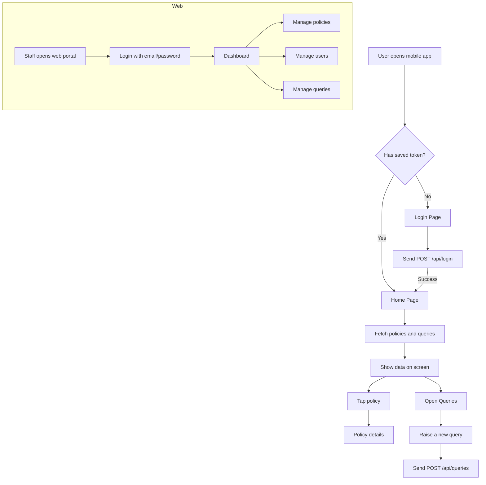
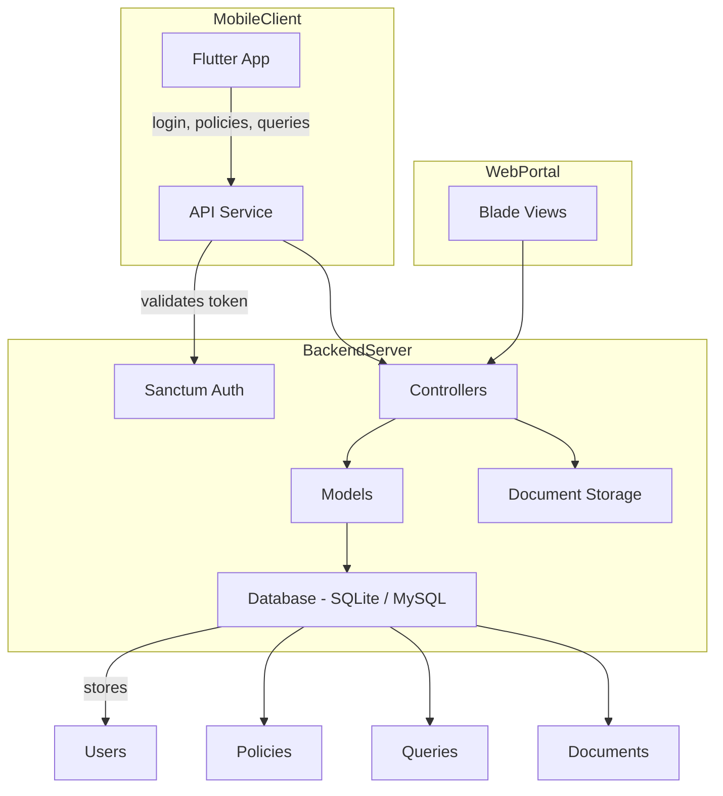

# Better SOP: Zimnat Policy Management System

## Purpose of this document

This document is written for a complete beginner who has never used these technologies before. It explains the whole application in simple terms, including:
- the architecture,
- the technologies used,
- how data is stored,
- the main components,
- the application flow,
- the best SDLC model for this project,
- an architecture diagram,
- and practical improvements to make the user experience better.

It applies to both the frontend and the backend.

---

## 1. What this application is

This system is an insurance policy management app with two main parts:
1. a **staff web application** for Zimnat employees to manage policies, clients, documents, and queries,
2. a **client mobile application** for policyholders to sign in, view policies, and ask questions.

The backend is the central power source that connects both the web app and mobile app with the database.

---

## 2. The overall architecture

### Simple explanation
Think of the application as a small business with:
- a **storefront** (what users see),
- a **warehouse manager** (the backend server),
- and a **storage room** (the database).

### Components
- **Staff Web Portal**: built with Laravel and Blade templates.
- **Mobile App**: built with Flutter.
- **Backend Server**: built with Laravel and provides APIs.
- **Database**: by default, SQLite.
- **Authentication**: Laravel Sanctum handles mobile login securely.

### Diagram
```mermaid
flowchart LR
    Mobile[Mobile App (Flutter)] -->|HTTPS JSON Requests| Backend[Backend API (Laravel)]
    Web[Staff Web Portal (Laravel Blade)] -->|Internal Requests| Backend
    Backend -->|SQL Queries| Database[(Database file / server)]
    Backend -->|File Storage| Documents[(Policy Documents)]
    Mobile -->|Token Storage| LocalStorage[(Shared Preferences)]
```

### Explanation of the diagram
- The **mobile app** asks the backend for data.
- The **web portal** also asks the backend.
- The **backend** reads and writes data in the **database**.
- The backend also stores document files and serves them when needed.
- The mobile app keeps a login token locally so the user does not need to sign in every time.

---

## 3. The technology stack (tech stack)

This project uses several tools together.

### Backend technologies
- **Laravel 11**: a PHP framework used to build web applications and APIs.
- **PHP 8.5**: the programming language Laravel uses.
- **Laravel Sanctum**: a security system that gives safe login tokens to mobile users.
- **Tailwind CSS**: a styling tool used to make the web interface look clean.
- **Alpine.js**: a small JavaScript tool to make some web pages interactive.
- **Blade**: Laravel's template system that creates the HTML pages for staff users.

### Frontend technologies
- **Flutter 3.41**: a framework for building mobile applications.
- **Dart**: the programming language used by Flutter.
- **Shared Preferences**: a small storage system inside the mobile app to save the login token.
- **HTTP package**: the Flutter code uses it to send and receive data from the backend.

### Database technologies
- **SQLite**: a simple file-based database used by default in this project.
- **MySQL**: also supported by the project if you choose to use it instead.

### Why these technologies?
- **Laravel** is good for beginners because it makes many hard things easier.
- **Flutter** is good because one mobile codebase can support both iOS and Android.
- **SQLite** is good for prototypes because it does not need a separate server.

---

## 4. Which database is used and how data is stored

### Default database: SQLite
In this project, the default database is **SQLite**.

That means:
- data is stored in a file,
- the file is located at: `backend/database/database.sqlite`,
- this works without installing a separate database server.

The application can also support **MySQL** if the project is changed in `backend/.env`.

### What tables exist in the database
The backend defines tables using migrations and seeders. Important tables are:
- `users`: stores staff and clients, plus their roles.
- `policies`: stores the insurance policy records.
- `queries`: stores questions or issues raised by clients.
- `documents`: stores uploaded policy files linked to policies.

### How data is stored
Example:
- A client logs in, and the backend checks `users`.
- When a policy is created, it is saved in `policies`.
- If a client sends a query, it is saved in `queries`.
- Documents are stored physically in storage and referenced from the database.

### Database connections
The database settings are found in `backend/config/database.php`.

The actual database type comes from `backend/.env`:
- `DB_CONNECTION=sqlite` means SQLite.
- `DB_CONNECTION=mysql` means MySQL.

This project is currently configured to use SQLite by default.

---

## 5. Backend structure and how it works

### 5.1 Backend directory layout
The backend files are mostly in `backend/`.

Important folders:
- `backend/app/Http/Controllers`: code that receives user requests and returns data or pages.
- `backend/routes`: defines the paths users can visit.
- `backend/database/migrations`: defines database tables.
- `backend/database/seeders`: creates initial users and policies.
- `backend/resources/views`: contains Laravel Blade templates used by the staff web portal.

### 5.2 API endpoints for the mobile app
The mobile app talks to the backend using these API routes found in `backend/routes/api.php`:
- `POST /api/login` - login the mobile user.
- `GET /api/user` - read the logged-in user profile.
- `GET /api/policies` - list the client’s policies.
- `GET /api/policies/{policy}` - read a policy’s details.
- `GET /api/queries` - list client queries.
- `POST /api/queries` - send a new query.

The routes inside `Route::middleware('auth:sanctum')` are protected. That means the mobile app must send a valid token.

### 5.3 Staff web routes
The staff web portal uses routes in `backend/routes/web.php`:
- `/dashboard` - main dashboard after login.
- `/users` - manage system users (staff or clients).
- `/policies` - manage policies.
- `/policies/{policy}/documents` - upload documents for a policy.
- `/queries` - view and respond to client queries.
- `/profile` - update your own profile.

These routes use Laravel authentication. They also use **role-based middleware** so only admins and policy officers can manage users, policies, and queries.

### 5.4 Authentication and security
- The mobile app logs in with `/api/login`.
- The backend returns a bearer token when login succeeds.
- The mobile app stores the token in `SharedPreferences`.
- Every protected API request includes the token in the `Authorization` header.
- This is handled by **Laravel Sanctum**.

### 5.5 Backend models
The backend stores data using models like:
- `User` for users,
- `Policy` for policies,
- `Query` for client issues,
- `Document` for uploaded files.

Models are the code representation of database tables.

### 5.6 Seed data
The backend includes a seeder file: `backend/database/seeders/DatabaseSeeder.php`.
It creates initial accounts like:
- admin@zimnat.co.zw / password
- officer@zimnat.co.zw / password
- client@example.com / password

It also creates an initial policy record.

---

## 6. Frontend components and how they work

This project has two frontend parts:
1. the **staff web portal** (Blade + Laravel),
2. the **mobile app** (Flutter).

### 6.1 Staff web portal
This is the part staff use in a browser.

How it works:
- Laravel authenticates the staff user.
- Blade templates render HTML pages.
- Staff can navigate to pages like `/dashboard`, `/policies`, `/users`, and `/queries`.
- Those pages send requests to controllers, which talk to the database and return HTML responses.

This is a traditional server-side web app.

### 6.2 Mobile app
The mobile app is in `mobile/lib/`.

Important files:
- `mobile/lib/main.dart` - app entry point.
- `mobile/lib/login_page.dart` - login screen.
- `mobile/lib/home_page.dart` - main mobile dashboard.
- `mobile/lib/api_service.dart` - connects the app to the backend.
- `mobile/lib/policy_details_page.dart` - shows policy details.
- `mobile/lib/query_page.dart` - raises and lists queries.
- `mobile/lib/models.dart` - data structures for Policies and Queries.

#### 6.2.1 App launch flow
1. `main.dart` starts the app.
2. It checks if a login token already exists in local storage.
3. If a token exists, the app opens `HomePage`.
4. If not, it opens `LoginPage`.

#### 6.2.2 Login process
- The user enters email and password.
- The app sends a `POST` request to `/api/login`.
- If the server validates the credentials, it returns a token.
- The app stores that token and opens the home screen.

#### 6.2.3 Home page and navigation
- The home page lets the user switch between tabs like "My Policies", "Renewal Dates", "Documents", and "Queries".
- The app calls the API to fetch policy and query data.
- When a policy is tapped, the app opens `PolicyDetailsPage`.
- The user can also logout, which clears the saved token.

#### 6.2.4 API service
The `ApiService` class does the following:
- builds the backend address,
- sends login requests,
- stores and retrieves the login token,
- fetches policies,
- fetches policy details,
- fetches queries,
- sends a new query.

This keeps the mobile UI separate from the backend communication.

---

## 7. Application flow chart

### User journeys


### Explanation for a beginner
- The mobile app starts and checks whether the user is already logged in.
- If not logged in, the mobile app shows the login screen.
- After login, the app shows policy information and allows queries.
- The staff web portal is separate, and staff log in through the browser.
- Staff can create and edit policies and respond to questions.

---

## 8. Best SDLC model for this project

The best model for this type of project is **Agile**.

### Why Agile?
- the product is not fixed in advance,
- insurance features may change with feedback,
- teams need to demo working software quickly,
- changes can be made every week or every sprint.

### Suggested process
1. **Plan** what feature to build next (example: login or view policies).
2. **Develop** the feature in a short time period.
3. **Test** the feature manually or with simple tests.
4. **Demo** the feature to others.
5. **Repeat** and improve.

### Why not Waterfall?
Waterfall is too rigid for app development, especially when requirements can change during the project.

### What Agile means here
- build the mobile login first,
- then build the policy list,
- then build queries,
- then improve the design,
- then add features like documents and role control.

This structure is easier to explain in a handover because each step is one small working piece.

---

## 9. Architecture diagram (visual)

This is a simple architecture diagram showing the main pieces.



### What this diagram means
- The mobile app and web portal both depend on the backend.
- The backend is the central controller.
- The backend stores data in the database and files on disk.
- The backend checks who is allowed to do what using roles.

---

## 10. Improvements for better user experience

These improvements will make the system easier to use for clients and staff.

### 10.1 Mobile app improvements
- **Add loading feedback**: show progress spinners whenever the app waits for data.
- **Improve error messages**: show friendly messages like "Unable to connect. Please try again." instead of generic errors.
- **Add refresh**: allow the user to pull down to refresh policy data.
- **Add notifications**: push notifications when a query is answered or a policy is updated.
- **Add biometric login**: use fingerprint or FaceID instead of typing passwords.

### 10.2 Web portal improvements
- **Use dashboard cards**: show policy counts, open queries, and expiring policies.
- **Add search and filters**: allow staff to search for policy numbers or client names.
- **Add document previews**: let staff preview PDF or image documents without downloading.
- **Add validation feedback**: show clear messages when form fields are wrong.

### 10.3 Architecture improvements
- **Switch to MySQL or PostgreSQL** for production instead of SQLite.
- **Add logging and monitoring** to track errors in the backend.
- **Add automated tests** for login, policy list, and queries.
- **Separate mobile API routes** from web routes more clearly if the app grows.

### 10.4 Security improvements
- **Use HTTPS** in production to encrypt data.
- **Use stronger password rules** for staff and clients.
- **Limit file sizes** for document uploads.
- **Use role checking** on every action so only allowed users can do sensitive things.

---

## 11. What to say during handover

When presenting this application, explain these points clearly:
- The project is a **mobile-first client experience** with a **staff web portal**.
- The mobile app is built using **Flutter** and communicates with the backend through **API calls**.
- The backend is built using **Laravel**, which handles login, data storage, and business rules.
- The database is currently **SQLite** for the prototype, and can scale to **MySQL**.
- The app is designed in a way that the frontend and backend are separate.
- This makes it easier to replace the frontend later or add new mobile apps.

### Important handover details
- The mobile API endpoint is configured in `mobile/lib/api_service.dart`.
- The backend login and data endpoints are in `backend/routes/api.php`.
- The web portal routes are in `backend/routes/web.php`.
- The database file is at `backend/database/database.sqlite`.
- Seed users are created in `backend/database/seeders/DatabaseSeeder.php`.

### What to expect if asked about code
- The mobile UI is built with **standard Flutter widgets** like `Scaffold`, `AppBar`, `ListView`, and `TextField`.
- The backend controllers handle business logic and return JSON for the mobile app.
- The mobile app stores the login token in local storage so users stay signed in.
- The backend uses **Sanctum** to keep API access secure.

---

## 12. How to use this document

This file is saved as `BETTER_SOP.md` in the project root.

- Open it in a text editor or browser.
- Use it during your presentation.
- Share it with the next person taking over the project.
- If you want, print it as a PDF from your editor.

---

## 13. Quick references

### Useful file locations
- `backend/.env` - database and environment configuration.
- `backend/config/database.php` - database connection settings.
- `backend/routes/api.php` - mobile API endpoints.
- `backend/routes/web.php` - staff web portal routes.
- `backend/database/seeders/DatabaseSeeder.php` - initial user and policy data.
- `mobile/lib/api_service.dart` - backend communication for the mobile app.
- `mobile/lib/login_page.dart` - mobile login screen.
- `mobile/lib/home_page.dart` - mobile dashboard.

### Default login accounts
- **Admin**: `admin@zimnat.co.zw` / `password`
- **Policy Officer**: `officer@zimnat.co.zw` / `password`
- **Client**: `client@example.com` / `password`

---

## 14. Final note

This project is a prototype designed to show how policy management can work in a real company. The structure is easy to understand, and the code is ready for improvements.

Keep this document as your reference during the handover session, and use the diagrams and simple explanations to guide someone who has never used Laravel or Flutter before.
